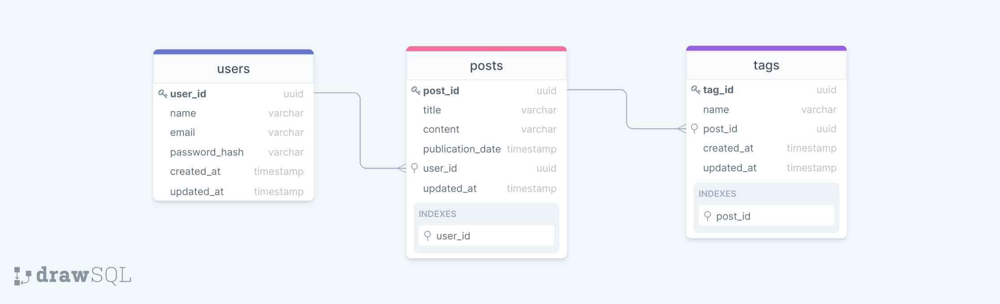

## Teste para estágio de desenvolvedor back-end na Voxus

[Link do projeto zipado no Google Drive](googledrive.com/link)

Modelo do banco:
<h1>
  
</h1>

[Quadro do projeto no Trello](https://bit.ly/2TfwkV1)

CREATE EXTENSION IF NOT EXISTS "uuid-ossp"